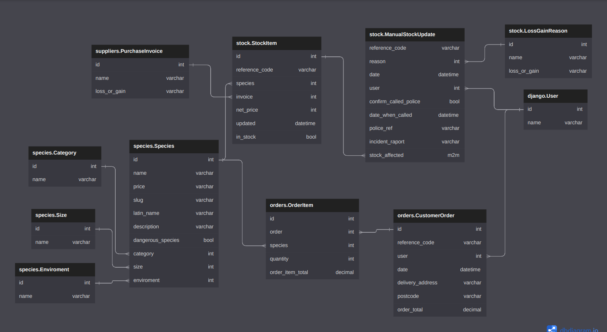

# Bag of Bugs
e-commerce application to manage the stock of the shop that is selling bugs. [Deployed to Railway](https://bagofbugs-production.up.railway.app/)

## Running project locally

### Clone
clone project locally (you will need to have ssh key set up on github)
```
git clone git@github.com:JoGorska/bag_of_bugs.git
```
or use
```
git clone https://github.com/JoGorska/bag_of_bugs.git
```
### Virtual enviroment
I used venv, you can use any other. To make virtual enviroment
```
python3 -m venv <env_name>
```
activate env
```
source <env_name>/bin/activate
```
install requirements
```
pip3 install requirements.txt
```

### Enviromental variables
add .env file in core folder
you will need 
```
SECRET_KEY=<add your secret key here>
```

you can also add development variable to have debug=true
```
DEVELOPMENT=True
```
I also have database_url for my postgres database, If no DATABASE_URL is set, than it defaults to sqlite database.

## Database Design

Database was design to handle the stock levels of the products. 

The products for this e-commerce store are bugs. Model representing products is Species. User can make a decision which species he would like to buy. The [dbdiagram.io](https://dbdiagram.io/d/63d732e7296d97641d7ce68b) service was used to design the database



## List available products:

The list of all available products is effectively the list of all bugs. From models perspecitve this is a list of all Species. These are the items available for the user to purchase.

https://bagofbugs-production.up.railway.app/species/


## View stock levels for each product

Url pointing to slug of a particular species gives the details of this species and the stock level using foreign key reverse lookup

https://bagofbugs-production.up.railway.app/species/european-garden-spider/


## Incrementing stock levels
Stock items can be added in the stock endpoint.

https://bagofbugs-production.up.railway.app/stock/

## Decrementing stock levels

if the stock has been sold / lost / destroyed, it should not be deleted from the database, it should be marked as in_stock = False and manual stock update should be added 

### Decrementing stock levels with manual stock update
Decrementing stock value can happen if the stock runs away or dies. The Manual Stock Upade model handles such event. User can input manual stock update and add stock affected to many to many field

the reason for manual stock update - model has option loss or gain.

The signal from many to many field on ManualStockUpdate model updates stock item objects in stock field to true or false - depending on loss or gain.

https://bagofbugs-production.up.railway.app/stock/stock_update/


### Decrementing stock levels with customer orders
Creating orders happens in two steps. First user needs to create order with his address

https://bagofbugs-production.up.railway.app/orders/

than take the order refference number and go to this order's url to add order items into this order

https://bagofbugs-production.up.railway.app/orders/78A13C16F6C74073A247AE38D38E396C/

### Handling stock levels for customer orders

Order item serializer checks which species are available and displays only available species in the dropdown options
https://bagofbugs-production.up.railway.app/orders/78A13C16F6C74073A247AE38D38E396C/

As a next step - if customer chose quantity above current stock level of this species, the error is displayed to say that there isn't enough stock.

## Tests
coverage run --omit='*/env/*' manage.py test
coverage html

## Further development

need to add signals from order to mark stock as in_stock = False
need to add suppliers and handle stock intake - to create invoices and stock items. 

instead of getting code from random it would be good to generate qr code for each stock item. 
https://emmanuelkwakyenyantakyi.medium.com/qr-code-generator-api-with-django-369cae1d556f


## DRF tutorials:
Very Academy: Django + React, Restful API Course, Building a restful API

https://youtu.be/soxd_xdHR0o

Dennis Ivy DRF + React

https://youtu.be/c0x_AaPjNCY